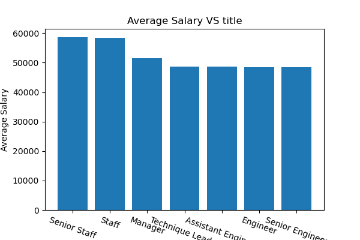

# SQL_Challenge


# <p align="center">Employee Database and Analysis<p>


# Background 


<b>It is a beautiful spring day, and it is two weeks since you have been hired as a new data engineer at Pewlett Hackard. Your first major task is a research project on employees of the corporation from the 1980s and 1990s. All that remain of the database of employees from that period are six CSV files.
In this assignment, you will design the tables to hold data in the CSVs, import the CSVs into a SQL database, and answer questions about the data. In other words, you will perform:</b>


# Data Modeling

Inspect the CSVs and sketch out an ERD of the tables. Courtesy [http://www.quickdatabasediagrams.com](http://www.quickdatabasediagrams.com).

 


# Data Engineering  

**Use [this schema](EmployeeSQL/Output/employeeschemas.sql) to create the tables**

- Tables are created in the order below to handle foreign keys.
  1. `departments`
  1. `dept_emp`
  1. `dept_manager`
  1. `employees`
  1. `salaries`
  1. `titles`

- All tables have primary key. Some primary keys also serve as Foreign keys.

- DATE conversion is required in the local Postgres to import the DATE format in CSV. During the data exploration, it is observed that DATE is in the format MDY, hence the local Postgres DB date has to be converted to match that. This can be reverted later once the data insertion is done.
```sql
  SET datestyle to MDY, SQL;
  select now()::date; -- to check
```


# Data Analysis


1. List the following details of each employee: employee number, last name, first name, sex, and salary.

- Create a view with the required data

   ```sql
    CREATE VIEW salary AS
    SELECT e.emp_no,e.last_name,e.first_name,e.sex,s.salary
    FROM salaries AS s
    JOIN employees AS e
    ON e.emp_no = s.emp_no;

    SELECT * FROM salary;
   ```


2. List first name, last name, and hire date for employees who were hired in 1986.

- Create a view with the required data

   ```sql
    CREATE VIEW hire AS
    SELECT first_name,last_name,hire_date
    FROM employees
    WHERE EXTRACT(YEAR FROM hire_date) = 1986;

    SELECT * FROM hire;
   ```


3. List the manager of each department with the following information: department number, department name, the manager's employee number, last name, first name.

- Create a view with the required data

   ```sql
    CREATE VIEW manager AS
    SELECT d.dept_no,d.dept_name,m.emp_no,e.last_name,e.first_name
    FROM dept_manager AS m
    JOIN departments AS d
    ON d.dept_no = m.dept_no
    JOIN employees AS e
    ON m.emp_no = e.emp_no;

    SELECT * FROM manager;
   ```

4. List the department of each employee with the following information: employee number, last name, first name, and department name.

- Create a view with the required data

   ```sql
    CREATE VIEW empdetail AS
    SELECT e.emp_no,e.last_name,e.first_name,d.dept_name
    FROM departments AS d
    JOIN dept_emp AS p
    ON p.dept_no = d.dept_no
    JOIN employees AS e
    ON e.emp_no = p.emp_no;

    SELECT * FROM empdetail;
   ```

5. List first name, last name, and sex for employees whose first name is "Hercules" and last names begin with "B."

- Create a view with the required data

   ```sql
    CREATE VIEW hercules AS
    SELECT first_name,last_name,sex
    FROM employees
    WHERE first_name = 'Hercules' AND last_name LIKE 'B%';

    SELECT * FROM hercules;
   ```

6. List all employees in the Sales department, including their employee number, last name, first name, and department name.

- Create a view with the required data

   ```sql
    CREATE VIEW sales AS
    SELECT e.emp_no,e.last_name,e.first_name,d.dept_name
    FROM departments AS d
    JOIN dept_emp AS p
    ON p.dept_no = d.dept_no
    JOIN employees AS e
    ON e.emp_no = p.emp_no
    WHERE d.dept_name = 'Sales';

    SELECT * FROM sales;
   ```

7. List all employees in the Sales and Development departments, including their employee number, last name, first name, and department name.

- Create a view with the required data

   ```sql
    CREATE VIEW salesanddevelopment AS
    SELECT e.emp_no,e.last_name,e.first_name,d.dept_name
    FROM departments AS d
    JOIN dept_emp AS p
    ON p.dept_no = d.dept_no
    JOIN employees AS e
    ON e.emp_no = p.emp_no
    WHERE d.dept_name = 'Sales' OR d.dept_name = 'Development';

    SELECT * FROM salesanddevelopment;
   ```

8. In descending order, list the frequency count of employee last names, i.e., how many employees share each last name.

- Create a view with the required data

   ```sql
    CREATE VIEW lastname AS
    SELECT last_name,COUNT(emp_no) AS employee_count
    FROM employees
    GROUP BY last_name
    ORDER BY COUNT(emp_no) DESC ;

    SELECT * FROM lastname;
   ```
# Data Visualization in Python  

1. Import the SQL database into Pandas. (Alternate option is to read the CSVs directly in Pandas)
   For connecting to the DB in Python, sqlalchemy toolkit is used. 
   For further details on SQL Alchemy, please visit their [website](https://www.sqlalchemy.org/).
   Consult [SQLAlchemy documentation](https://docs.sqlalchemy.org/en/latest/core/engines.html#postgresql) for implementation details.

   - Create a config file with the following information in the code folder.
     See [https://www.youtube.com/watch?v=2uaTPmNvH0I](https://www.youtube.com/watch?v=2uaTPmNvH0I) and [https://help.github.com/en/github/using-git/ignoring-files](https://help.github.com/en/github/using-git/ignoring-files) for more information on password protection in github.
   
     ```diff
        $ config.py 
        username = <USERNAME> 
        password = <PASSWORD>
        hostname = 'localhost' #If installed locally
        port = 5432 #Default port
        DB = 'EmployeeQLDB_Analysis' 
     ```
   
   - Connect to Postgres DB as below
   
     ```sql
        from config import username, password, hostname, port, DB
        from sqlalchemy import create_engine
        employee_uri = f'postgresql://{username}:{password}@{hostname}:{port}/{DB}'
        engine = create_engine(employee_uri, echo=True) #echo = True to log every query our SQL   database executes to the terminal
        connection = engine.connect()
     ```


2. Create a histogram to visualize the most common salary ranges for employees.

   - Direct SQL query result to pandas DF
     ```sql
        salary_df = pd.read_sql("SELECT * FROM salaries",connection)   
     ```
    - Histogram is plotted on the retrieved information. 
    - **Salary range is 40000 to 129492**
    - **Mean salary is 52970.7**
    
       

3. Create a bar chart of average salary by title.

   - Direct SQL query result to pandas DF
     
     ```sql
        query = "SELECT titles.title, AVG(s.salary) AS Average_Salary \
        FROM employees AS e \
        LEFT JOIN salaries AS s ON e.emp_no = s.emp_no \
        LEFT JOIN titles ON e.emp_title = titles.title_id \
        GROUP BY titles.title \
        ORDER BY Average_Salary DESC"

        AVG_salary = pd.read_sql(query,connection)
     ```
   - Barchart is plotted on the retrieved information.
   - **All the technical positions have less average salary compared to managerial positions**
   - **Senior Engineer position has less average salary than Engineer and Assistant Engineer. This is proof that this data is fake**
   
     


# Epilogue

Evidence in hand, you march into your boss's office and present the visualization. With a sly grin,   
your boss thanks you for your work. On your way out of the office, you hear the words, "Search your ID number." You look down at your badge to see that your employee ID number is 499942.

  - Checking my data !
  
    ```sql
        query = "SELECT * FROM employees WHERE emp_no = 499942"
        myid = pd.read_sql(query,connection)
     ```


Knew it was FAKE before I walked into your office.  
  
**All the technical positions have less average salary compared to managerial positions**  
**Senior Engineer position has less average salary than Engineer and Assistant Engineer. This is proof that this data is fake**